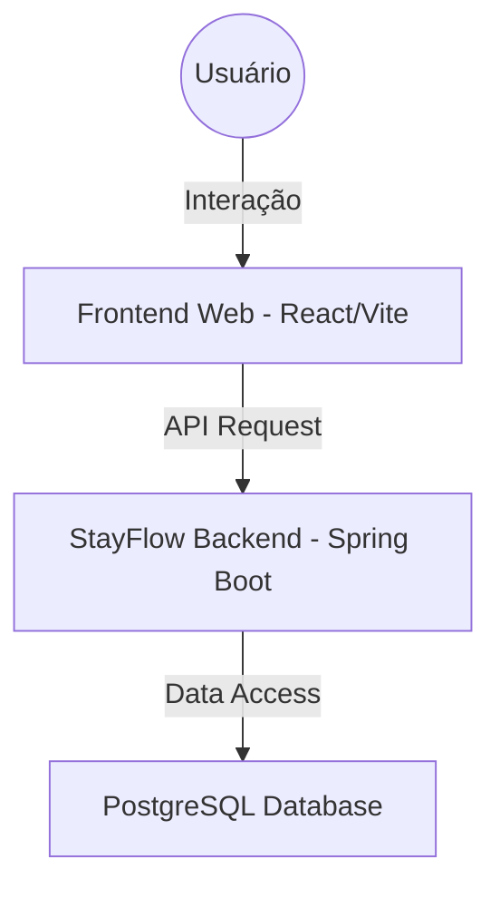

# 🌊 StayFlow Hotel System (Especialista)


Este projeto é uma transformação **Especialista** do sistema legado "Sistema Hotel". Evoluímos uma aplicação Desktop Swing para uma infraestrutura moderna de **Gerenciamento Hoteleiro**, baseada na arquitetura **StayFlow**.

---

## 🏗️ Arquitetura do Sistema (StayFlow Specialist)

Conforme solicitado, o sistema implementa uma arquitetura robusta e escalável:



### Principais Diferenciais Técnicos

1. **Interface Moderna**: Desenvolvida com React, Vite, Framer Motion e Lucide-Icons para uma experiência de usuário premium.
2. **Dashboard em Tempo Real**: Estatísticas dinâmicas integradas diretamente com o backend.
3. **Database Especialista**: Migrado para PostgreSQL com tipos de alta precisão (`NUMERIC` para valores financeiros e `DATE` para registros temporais).
4. **Segurança Simplificada**: Configuração pronta para expansão, focada em performance e facilidade de manutenção.

---

## 🗄️ Modelo de Dados (Especialista)

Refatoramos o modelo para garantir integridade e performance:

| Tabela | Coluna | Tipo | Descrição |
| :--- | :--- | :--- | :--- |
| `reservas` | `id` | SERIAL | Chave Primária |
| `reservas` | `valor` | NUMERIC(12,2) | Precisão financeira absoluta |
| `reservas` | `data_entrada` | DATE | Formato otimizado |
| `hospedes` | `id` | SERIAL | Chave Primária |
| `hospedes` | `nome` | VARCHAR(25) | Nome do hóspede |

---

## 🚀 Como Executar o Stack StayFlow

### Pré-requisitos
*   Java 21
*   Docker & Docker Compose
*   Node.js (v18+)

### 1. Subir a Infraestrutura
Use o `docker-compose.yml` para subir o banco de dados:
```bash
docker-compose up -d
```

### 2. Executar o Backend

```bash
mvn spring-boot:run
```

### 3. Executar o Frontend

```bash
cd frontend
npm install
npm run dev
```

Acesse em: `http://localhost:3000`

---

## 📜 Licença
Este projeto foi transformado e é agora mantido por **Rafael (Especialista)**. Sob o selo StayFlow Hotel.
